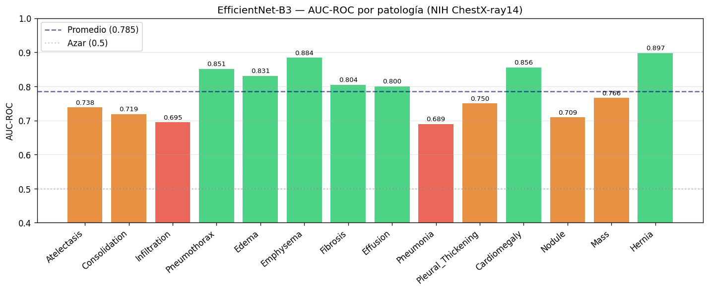
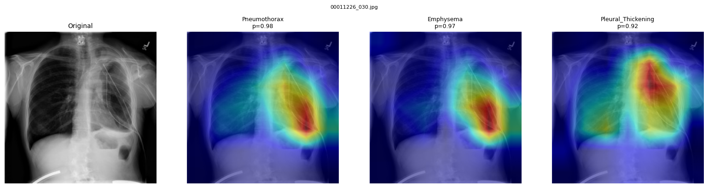

# BioAI Hub

[](https://github.com/torillotomas/bioai-hub/actions/workflows/ai-service.yml)
[](https://github.com/torillotomas/bioai-hub/actions/workflows/frontend.yml)
[](https://github.com/torillotomas/bioai-hub/actions/workflows/backend.yml)

Plataforma para analizar radiografías de tórax con IA. Subís una imagen, el modelo clasifica la patología y te muestra un mapa de calor (Grad-CAM) que resalta qué zona de la radiografía influyó en el diagnóstico.

Proyecto personal de aprendizaje. Quería construir algo end-to-end que funcionara de verdad: modelo entrenado sobre datos reales, backend con auth, frontend usable.

---

## Resultados del modelo

EfficientNet-B3 entrenado sobre NIH ChestX-ray14 (112k radiografías, 14 patologías):



| Métrica | Valor |
|---|---|
| AUC-ROC promedio (test set) | **0.785** |
| AUC-ROC promedio (val set) | 0.820 |
| Mejor patología | Hernia — 0.897 |
| Peor patología | Pneumonia — 0.689 |
| Parámetros | ~12M |
| Entrenado en | AMD Ryzen 5 7520U (CPU) · ~18h |

Referencia: CheXNet (DenseNet121) reporta 0.841 con más datos de augmentation y entrenamiento más largo.

**Grad-CAM** — el modelo mira las zonas anatómicamente correctas:



---

## Qué hace

Subís una radiografía de tórax y en unos segundos tenés:

- Clasificación con probabilidad de confianza
- Scores por patología
- Overlay Grad-CAM sobre la imagen original — mapa de calor que muestra qué zona activó el diagnóstico
- Historial de análisis asociado a tu usuario

## Stack

| Capa | Tecnología |
|---|---|
| Frontend | React 18 · Vite · TypeScript · Tailwind CSS |
| Backend | NestJS · TypeScript · SQLite (TypeORM) |
| IA | FastAPI · PyTorch · EfficientNet-B3 (NIH ChestX-ray14) |

## Cómo funciona por dentro

```
Navegador
  └─ POST /api/v1/analysis (multipart/form-data)
       └─ NestJS: valida MIME + tamaño · JWT · hashea imagen · guarda en SQLite
            └─ POST /predict-with-cam (imagen en base64)
                 └─ FastAPI: imagen → EfficientNet-B3 → probabilidades por patología
                           + Grad-CAM (backward sobre último bloque convolucional) → overlay JPEG
```

El modelo es EfficientNet-B3 fine-tuned sobre NIH ChestX-ray14 (112k radiografías, 14 patologías). AUC-ROC 0.785 en test set. El modelo se carga desde disco (`MODEL_PATH` en `.env`).

El Grad-CAM hookea `model.features[-1]`. El mapa de calor sale en resolución 7×7 y se escala a 224×224 antes de superponerse sobre la imagen con colormap JET.

## Notebooks de entrenamiento

Además de la app, tengo una serie de notebooks donde fui construyendo el pipeline de ML médico desde cero. Los separé en dos etapas:

**`notebooks/colab/` — progresión desde cero**

| Notebook | Contenido |
|---|---|
| `layer1_primeros_pasos.ipynb` | Entorno, GPU, primeros pasos con PyTorch |
| `layer2_primera_cnn.ipynb` | BioAICNN desde cero sobre Chest X-Ray Kaggle · AUC 0.94 en clasificación binaria |
| `layer3_metricas_y_mejoras.ipynb` | Métricas, augmentation, regularización |
| `layer4_nih_dataset.ipynb` | Pipeline multi-label sobre NIH ChestX-ray14 · 14 patologías · 112k imágenes |

**`notebooks/transfer_learning/` — fine-tuning con EfficientNet-B3**

| Notebook | Contenido |
|---|---|
| `efficientnet_nih.ipynb` | Fine-tuning de EfficientNet-B3 (ImageNet) sobre NIH ChestX-ray14 · dos fases (backbone congelado → descongelado) · AUC-ROC 0.785 en test · Grad-CAM sobre las 14 patologías |

El entrenamiento lo corrí localmente en CPU (AMD Ryzen 5 7520U, 16GB RAM). Fase 1 (3 epochs, solo clasificador): AUC val 0.711. Fase 2 (5 epochs, backbone completo): AUC val 0.820 / AUC test 0.785. Los papers de referencia (CheXNet, DenseNet121) reportan 0.84 con arquitecturas más grandes y más tiempo de entrenamiento.

El notebook incluye Grad-CAM sobre el último bloque convolucional (`model.features[-1]`, resolución 7×7×1536). Muestras en [`gradcam_samples/`](notebooks/transfer_learning/gradcam_samples/).

## Requisitos

- Node.js 20+, pnpm 9+
- Python 3.11+
- Docker (opcional)

## Instalación

```bash
git clone https://github.com/torillotomas/bioai-hub.git
cd bioai-hub

# JS
pnpm install

# Python
cd apps/ai-service && pip install -r requirements.txt
```

Copiá `.env.example` a `.env` y completá los JWT secrets antes de levantar.

## Levantar

**Con Docker:**
```bash
docker compose up
```

**Sin Docker (3 terminales):**
```bash
cd apps/ai-service && uvicorn app.main:app --port 8000 --reload
cd apps/backend && pnpm run dev
cd apps/frontend && pnpm run dev
```

Abrí http://localhost:5173. La primera vez que arranca el servicio de IA descarga el modelo, esperá unos segundos antes del primer análisis.

## API

Requiere JWT. Registrarse en `POST /auth/register` y obtener token en `POST /auth/login`.

### `POST /api/v1/analysis`

```
Authorization: Bearer <token>
Content-Type: multipart/form-data

file:     <imagen> (JPEG · PNG · WebP · máx 10MB)
metadata: { "patientId": "PAC-001", "studyType": "chest_xray" }
```

```json
{
  "analysis_id": "uuid",
  "status": "completed",
  "result": {
    "prediction": "Pneumonia",
    "confidence": 0.87,
    "class_scores": { "Pneumonia": 0.87, "Atelectasis": 0.43 },
    "model_version": "v3.0.0",
    "inference_time_ms": 380,
    "heatmap_b64": "<JPEG en base64>"
  },
  "audit": {
    "processed_at": "2026-06-02T16:00:00.000Z",
    "node_version": "v22.x",
    "image_hash_sha256": "abc123..."
  }
}
```

### `GET /api/v1/analysis`

Últimos 20 análisis del usuario autenticado, ordenados por fecha.

### Errores

| Código | Cuándo |
|---|---|
| 401 | Sin token o token vencido |
| 413 | Imagen mayor a 10MB |
| 415 | Formato no soportado |
| 503 | El servicio de IA no está corriendo |

## Tests

```bash
# Python — predictor, transforms, health, Grad-CAM
cd apps/ai-service && pytest tests/ -v

# Backend — auth + analysis
cd apps/backend && pnpm test
```

Los tests de Python no necesitan el modelo descargado, usan pesos aleatorios.

---

> Proyecto educativo. Los resultados no reemplazan el criterio de un médico.
